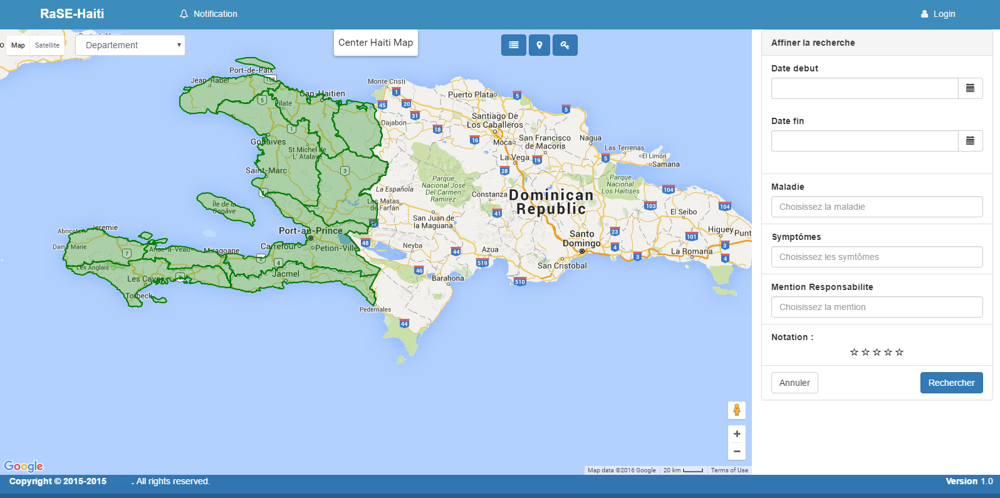
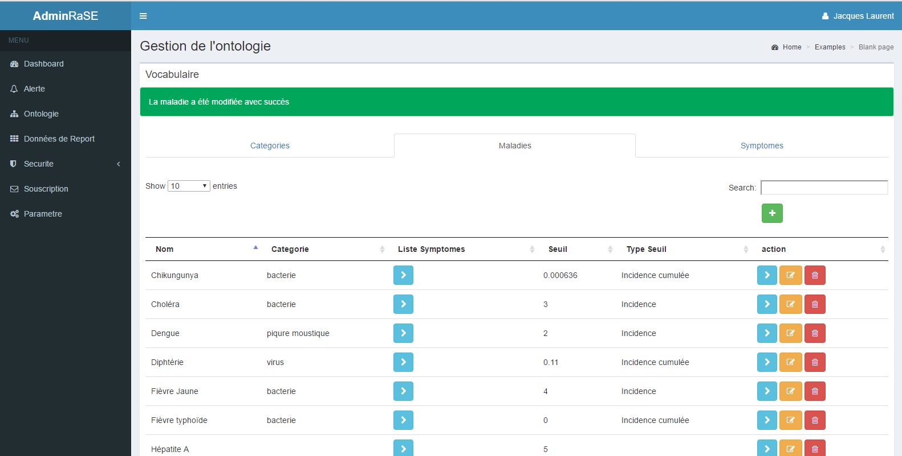

# RaSEClientWeb
Project RaSE (Social Radio for Epidemiology detection) - context of Haiti - Angular JS client

This client is to be connect with the RaSE Server ( Spring framework web service )

Team of 2 (Master 2 MBDS Industrial project)

- Gaetan Robert Lescouflair
- Kathleen Jean-Baptiste 

**Example of user interface **

**Example of Admin interface **

